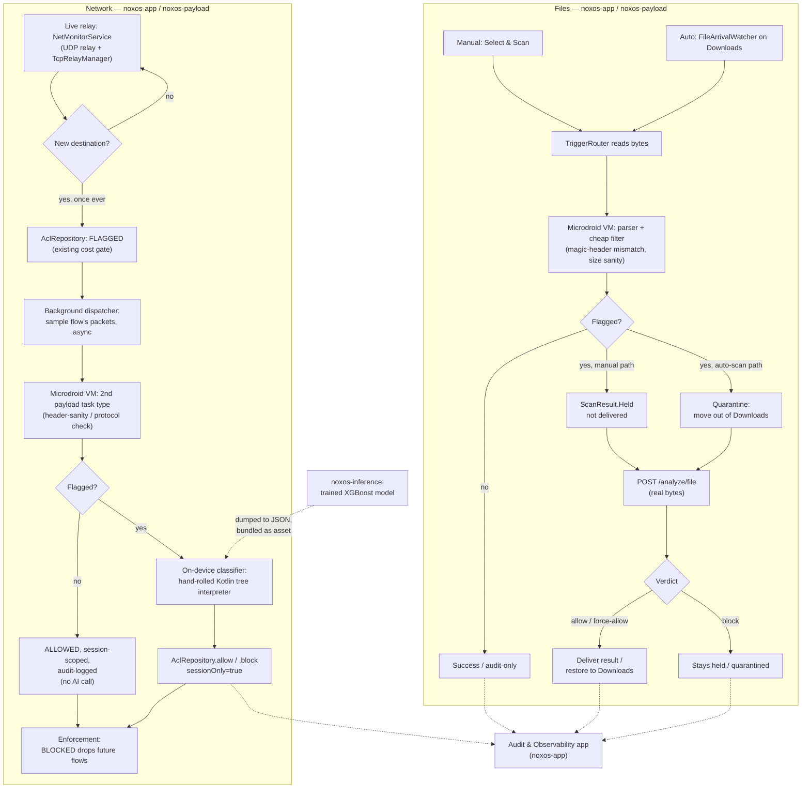
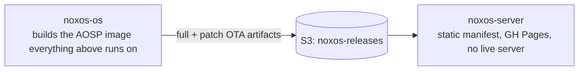

# Knowledge Hub

Private project documentation for NoxOS — not published, not linked from any repo's public README. Lives outside git entirely (gitignored at the NoxOS root); this is context for us and for future AI sessions, not for the public repos.

## Start here (any AI, any session, no prior context assumed)

This directory is written to be self-contained — everything a fresh session needs to pick this project up cold, without access to any prior conversation. Read in this order:

1. **This file** — repo map, per-repo pointers, data flow.
2. **[`PROJECT.md`](PROJECT.md)** — full architecture, every major decision and *why* it was made, the 14-phase roadmap. This is the single source of truth; if anything elsewhere contradicts it, this file wins.
3. **The relevant repo's own `<repo>/TASKS.md` + `<repo>/README.md`** below, for whichever repo you're about to touch — task history is per-repo (as of 2026-09-12), not one combined file, so a session working on a single repo only needs to load that repo's own pair of files. [`TASKS.md`](TASKS.md) at this top level is now just an index pointing to each repo's file — start there if you're not sure which repo(s) are relevant yet.

Verify before trusting: this project moves fast and these docs can lag reality. Any claim here that names a specific file/function/commit is a claim about *when it was written* — run `git log`/`git status` in the repo in question before acting on it, same as the general rule for any inherited context.

**Full architecture, decisions, and roadmap:** [`PROJECT.md`](PROJECT.md) — read that first for the "why."
**What to actually do next, per repo:** [`TASKS.md`](TASKS.md) (index) → `<repo>/TASKS.md`.

Last reviewed: 2026-09-12

## Structure

```
knowledge-graph/
├── README.md                    # this file — hub, points everywhere else, "start here" for any AI
├── PROJECT.md                    # full architecture, decisions, roadmap (source of truth)
├── TASKS.md                       # index only — points to each repo's own TASKS.md below
├── discussions.md                # user ↔ root-agent conversation log ONLY — not a technical archive, see its own header
├── noxos-os/README.md            # AOSP customization — infra scripts, local manifest, CI
├── noxos-os/TASKS.md              # noxos-os's own session-by-session task history
├── noxos-os/CUTTLEFISH.md        # local Cuttlefish container setup detail
├── noxos-payload/README.md       # Microdroid native payload — AVF research findings
├── noxos-payload/TASKS.md         # noxos-payload's own task history
├── noxos-app/README.md           # host Android app (Warden) — Gradle module layout
├── noxos-app/TASKS.md             # noxos-app's own task history (session log)
├── noxos-app/VM-BOOT-SAGA.md     # the full VM-boot investigation (idsig, vsock race, SELinux) — read this, not TASKS.md, for that story
├── noxos-server/README.md        # OTA update server — API shape
├── noxos-server/TASKS.md          # noxos-server's own task history
├── noxos-inference/README.md     # threat-analysis inference backend
├── noxos-inference/TASKS.md       # noxos-inference's own task history — model training/metrics/hosting; ML ground-agent owns this directory
└── noxos-inference/ML-NETWORK-DESIGN.md # network-classifier design history — cheap filter, wire contract, feature set, XAI (spans noxos-app + noxos-inference; coordinate ML work through noxos-inference)
```

**Large or multi-topic files get split, not left as one growing log** — `noxos-app/TASKS.md` split its VM-boot investigation and ML-design history into their own files above once they got large enough that a reader only interested in one topic would otherwise have to pull in the other. If a repo's `TASKS.md` starts covering a self-contained topic at length, split it the same way rather than letting one file become the de facto choke point again (this happened once already, with `discussions.md` — see that file's own header).

## Branding

`../assets/branding/` (root repo, public) — the logo mark: a hexagon (VM isolation boundary) around a crescent moon (*nox* = night), navy `#0B1220` + teal `#4FD1C5`. Source of truth for `noxos-app`'s launcher icon and `noxos-os`'s boot animation, both of which vendor their own copy. See `../assets/branding/README.md`.

## Per-repo index

| Repo | Language | What it does | Context |
|---|---|---|---|
| [noxos-os](https://github.com/parrothacker1/noxos-os) | Shell + AOSP/Soong | AOSP fork build pipeline — local manifest, infra scripts, self-hosted CI | [`noxos-os/README.md`](noxos-os/README.md) + [`noxos-os/TASKS.md`](noxos-os/TASKS.md) |
| [noxos-payload](https://github.com/parrothacker1/noxos-payload) | C++ (Android.bp) | Native payload that runs inside the Microdroid pVM | [`noxos-payload/README.md`](noxos-payload/README.md) + [`noxos-payload/TASKS.md`](noxos-payload/TASKS.md) |
| [noxos-app](https://github.com/parrothacker1/noxos-app) | Kotlin (Gradle) | Host-side Android app (**Warden**) — trigger/router, VPN monitor, audit UI, ACL | [`noxos-app/README.md`](noxos-app/README.md) + [`noxos-app/TASKS.md`](noxos-app/TASKS.md); VM-boot bugs → [`VM-BOOT-SAGA.md`](noxos-app/VM-BOOT-SAGA.md) |
| [noxos-server](https://github.com/parrothacker1/noxos-server) | Bash + GitHub Actions | Static OTA manifest publisher (GH Pages) — not a running service | [`noxos-server/README.md`](noxos-server/README.md) + [`noxos-server/TASKS.md`](noxos-server/TASKS.md) |
| [noxos-inference](https://github.com/parrothacker1/noxos-inference) | Python (FastAPI) | Self-hosted threat-analysis backend for Warden's flagged traffic/files — **owns all ML/XGBoost work; coordinate through this repo** | [`noxos-inference/README.md`](noxos-inference/README.md) + [`noxos-inference/TASKS.md`](noxos-inference/TASKS.md); network-classifier design → [`ML-NETWORK-DESIGN.md`](noxos-inference/ML-NETWORK-DESIGN.md) |

No `INDEX.md` / `index.json` function-level indexes yet. Add those per-project once it's clear they'd earn their keep, same pattern as `patent-cron`'s knowledge-graph.

## Data flow (target architecture)

**Designed 2026-09-13, not built** — the two mermaid diagrams below are the current target shape (both a pKVM cheap-filter stage and, for network, an on-device classifier); full rationale and what's still open lives in [`PROJECT.md`](PROJECT.md)'s "Threat analysis" section and its "File and network pipelines" diagrams. What's actually shipped as of this writing is narrower — see Status below.





The `noxos-app`→`noxos-inference` leg is real and tested today — the dispatch loop was verified end-to-end against a stand-in responder 2026-09-12, and as of 2026-09-13 `noxos-inference` has a real trained classifier + FastAPI service (not yet deployed to a live box, and it's still the cloud call the diagram's on-device classifier is meant to supersede for network traffic — see `PROJECT.md` for that open question). The pKVM cheap-filter stage (both diagrams), file quarantine, and the on-device classifier itself are all still plans, not code. See [`noxos-inference/TASKS.md`](noxos-inference/TASKS.md), [`noxos-app/TASKS.md`](noxos-app/TASKS.md) session 13, and [`noxos-payload/TASKS.md`](noxos-payload/TASKS.md).

## Status

Don't trust a summary here — read each repo's own `TASKS.md` (index at [`TASKS.md`](TASKS.md)), kept current per-repo; this isn't. As of 2026-09-22: all five repos exist, CI green where CI exists. `noxos-os` has shipped Phase 1c for real — Warden baked in as a signed priv-app, `MANAGE_VIRTUAL_MACHINE` genuinely granted on real hardware. `noxos-app` (branded **Warden**) and `noxos-payload` together closed out the entire VM-boot saga (idsig v3-signing, the vsock race, the gceservice SELinux regression, and the payload's missing static-libc++ `exit=1` bug) — both the file-scan and network-sample-VM paths now work end to end on a real device for the first time in the project's history, plus quarantine, model-download/digest-gating, and full VPN "Start Monitoring" are all confirmed working. See `noxos-app/VM-BOOT-SAGA.md` for the full story. `noxos-server` has a drafted-not-deployed OTA-signing Lambda. `noxos-inference`'s model/training status is tracked in its own `TASKS.md`/`ML-NETWORK-DESIGN.md`, not summarized here.

## Conventions

- **Commits:** `type: message` (Conventional Commits — `feat:`, `fix:`, `chore:`, etc.), no `Co-Authored-By` trailer. The early "init" commits across all repos predate this convention being stated explicitly — left as-is, not retrofitted. Every repo in this project (`noxos-app`, `noxos-os`, `noxos-inference`, `noxos-payload`, `noxos-server`, plus this top-level `NoxOS/` checkout) has its own local, gitignored `CLAUDE.md` restating this + the no-comments rule — **renamed from `AGENTS.md` session 21 (2026-09-14)**: Claude Code loads `CLAUDE.md` as persistent project context on every session/turn, independent of the conversation transcript, so it survives context compaction; a plain `AGENTS.md` only got read when a session happened to `Read` it, and that read (like any tool result) could be summarized away by compaction — which is exactly what caused a real mistake that session. See `noxos-app/TASKS.md` session 21 for the incident.
- **Repos:** public, under `github.com/parrothacker1`.
- **No code comments**, in any repo, even "why" comments — see each repo's own `TASKS.md` for when/why this was established.
- **IAM writes get blocked by this environment's auto-mode classifier** — every repo's infra work has hit this; the fix is always the same, hand the user the exact `aws iam ...` command to run manually via `!`.
- **GPG commit signing can hang** in a non-interactive session (no way to satisfy a `pinentry` prompt) — when this happens, ask the user before bypassing with `--no-gpg-sign`; if they authorize it, track which commits are unsigned and re-sign them (`git rebase --exec 'git commit --amend --no-edit -S'`) once resumed. This has happened at least three times across this project's history — see `noxos-os/TASKS.md` and `noxos-inference/TASKS.md` for examples.
