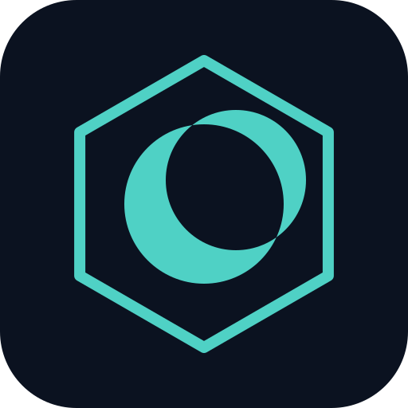

<div align="center">



# NoxOS

**A lightweight, security-focused alternative mobile OS**

---


</div>

---

## What is NoxOS?

NoxOS is a custom **de-Googled AOSP fork** that introduces a genuinely novel security primitive to Android: **hardware-backed ephemeral VM sandboxing for untrusted content**.

When you open a suspicious file — a download, a sideloaded APK, an image from an unknown source — NoxOS doesn't parse it in your app process or even in a standard Android sandbox. It spins up a **disposable Microdroid virtual machine** using Android's [pKVM hypervisor](https://source.android.com/docs/core/virtualization), runs the parser inside it, returns the sanitized result, and **destroys the VM entirely**. Nothing persists. No side-channel. No leftover state.

A companion **audit app** records every isolated execution and every flagged network flow, making the security guarantee *demonstrable* rather than a black box claim.

---

## Architecture

```
┌─────────────────────────────────────────────────────────────┐
│                         Host OS (NoxOS)                      │
│                                                             │
│   📁 Untrusted File ──────────────────────────────────┐    │
│   🌐 App Network Traffic → VpnService Monitor ────────┤    │
│                                                        ▼    │
│                                             ┌─────────────┐ │
│                                             │   noxos-app │ │
│                                             │ Trigger /   │ │
│                                             │ Router      │ │
│                                             └──────┬──────┘ │
└────────────────────────────────────────────────────│────────┘
                                                     │ Launch
┌────────────────────────────────────────────────────▼────────┐
│                  Microdroid pVM  (ephemeral)                 │
│                                                             │
│   Boot → [ noxos-payload EXIF Parser ] → Result → Destroy  │
│                                                             │
└──────────────────────────┬──────────────────────────────────┘
                           │
           ┌───────────────┴───────────────┐
           ▼                               ▼
   Sanitized Result                  Audit & Logs
   → Requesting App               → AuditListScreen
                                    (Room + Compose)
```

### Three Pillars

| Pillar | What it does |
|--------|-------------|
| **🪶 Lightweight** | Strips GMS/OEM bloat at build time. Trims fonts, locales, and kernel defconfig. Tunes ART compilation for faster boot and lower RAM. |
| **🔒 Secure** | Routes untrusted content into disposable Microdroid pVMs via Android's AVF/pKVM stack (SESIP Level 5 certified, Aug 2025). No persistence between scans. |
| **🔍 Observable** | Every VM scan and every flagged network flow is logged to a local Room database and surfaced in a Compose audit UI — the security claim is verifiable, not a marketing promise. |

---

## Repositories

<table>
<tr>
<th>Repo</th>
<th>Role</th>
<th>Stack</th>
</tr>
<tr>
<td><a href="https://github.com/parrothacker1/noxos-os"><b>noxos-os</b></a></td>
<td>AOSP fork — local manifest, build config, EC2 infra scripts, boot animation, CI</td>
<td>Shell · AOSP/Soong</td>
</tr>
<tr>
<td><a href="https://github.com/parrothacker1/noxos-payload"><b>noxos-payload</b></a></td>
<td>Native parser running inside the Microdroid guest VM — EXIF isolation sandbox</td>
<td>C++ · Android.bp</td>
</tr>
<tr>
<td><a href="https://github.com/parrothacker1/noxos-app"><b>noxos-app</b></a></td>
<td>Host Android app — VM trigger/router, VPN traffic monitor, Room audit trail, Compose UI</td>
<td>Kotlin · Jetpack Compose · Room</td>
</tr>
<tr>
<td><a href="https://github.com/parrothacker1/noxos-server"><b>noxos-server</b></a></td>
<td>Serverless OTA manifest — GitHub Actions → static JSON → GitHub Pages</td>
<td>Bash · jq · GitHub Actions</td>
</tr>
</table>

---

## Roadmap

```
Part I   — Foundation
  ✅  Literature survey · architecture · all repos scaffolded
  ✅  CI pipelines · branding · OTA manifest generator
  ⏳  Phase 1: EC2 Spot instance · AOSP sync · Cuttlefish boot

Part II  — Core Implementation
  ✅  Host app: Room audit DB · TriggerRouter · VmPayloadProtocol · Compose UI
  ✅  Guest payload: self-contained JPEG EXIF parser over vsock (C++)
  ✅  Net monitor: VpnService capture loop · IPv4 flow logging
  ⏳  Phase 2: Run Google's AVF reference demos on Cuttlefish · verify API contracts
  ⏳  Phase 6: Wire real payload into VM · jniLibs handoff
  ⏳  Phase 7: Adversarial EXIF test suite

Part III — OS Customization
  ⬜  P3–P5: GMS strip · kernel trim · ART tuning · device tree

Part IV  — Distribution
  ⬜  P11: App store integration (Aurora Store / microG)
  ⬜  P12: OTA end-to-end (client polls noxos-server manifest)

Part V   — Integration & Docs
  ⬜  P13: End-to-end demo on Cuttlefish
  ⬜  P14: Final documentation
```

---

## Why this matters

Android has shipped hardware-backed virtualization (AVF / pKVM) since Android 13 (2022). Nobody has shipped a **polished, user-facing feature** that uses it for automatic untrusted-content isolation:

- **GrapheneOS** devs publicly wanted this in 2023 — their VM Launcher is for general-purpose Linux desktops, not security-triggered content sandboxing.
- **Mainstream sandboxing apps** (Island, Shelter) only use work-profile/UID isolation — no pKVM.
- **Academic prior art** (Anception, ~2014) proposed VM-based isolation conceptually but needed a custom hypervisor. pKVM didn't exist yet.

NoxOS fills that gap, scoped to one payload type end-to-end (JPEG EXIF parsing) as an honest proof-of-concept rather than a vague claim.

---

## Branding

The mark is a **hexagon** (the VM isolation boundary — every untrusted payload runs inside one) around a **crescent moon** (*nox* = night). Navy `#0B1220` + teal `#4FD1C5`.

---

<div align="center">
<sub><a href="https://github.com/parrothacker1">parrothacker1</a></sub>
</div>
